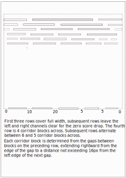

# Tippit - The tipping maze and ball game

## Introduction

An entertaining animated game of skill involving an upright maze through
which a ball is set to roll in order to reach a target. The user can tilt
the maze left or right to make the ball roll.

## Tools and Setup

The game is written in JS, React, Pixi/React

The setup is as follows:

-   npx create-react-app
-   npm install @pixi/react
-   npm install react-router-dom
-   npm install react-bootstrap

## Display Layout

There are two pages, the game page and the scores history page. There is also
a link to the Zing Games page.

### Game Page

The game page contains the maze and the current scores and feature buttons. On
a medium width screen the maze is to the left and the current scores and features
are on the right. On small screens the maze appears at the top, with the scores
and features below.

The maze is fixed at a width of 380 pixels, to allow for small screens. The height
of the maze is set near to 400 pixels, allowing for laptop screens, allowing for
20 rows of corridors set at 18 pixels high + 3 for the platforms = 420px.

## Maze Construction

The maze is randomly generated within certain parameters to produce an interesting
pathway of corridors and drop-down entrances. The left-right extremities of the
corridors cause a fall into a pit, which is a zero-score condition.

There should be about 20 layers of corridors, so if we assume a height of 420
pixels for the maze, the corridors should be about 21 pixels high and consequently
the ball 16 pixels in diameter. In this case the gaps (gates) between platforms 
should be about 18 pixels.

The graphics for the maze should be vector drawn, to allow for the different tilt 
angles.

The maze should be offset from the top of the display, to allow for the tilt-up of 
the corners. This sets a maximum tilt angle. Rotation is about the centre of the
maze.

Note that the choice of drops is always binary from any particular corridor. If we
allow for binary drops from each corridor, with a shared drop between adjacent corridors
then the number of possible pathways increases by 1.5 per level, so that after 4 levels
we have 6 corridor sections, this then becomes the standard for the rest of the maze.

The final (bottom) row should contain one success drop and five fail drops.

If the ball is travelling faster than a certain velocity, it should be able to jump a
drop.

If the ball in the maze passes the base of the display, the display should scroll
automatically.

The top of the maze has a handle which the user can drag and drop to tilt the maze.

### Maze Drawing Algorithm and Data

The data describing the maze is stored in the object mazeData, composed as follows:

```js
mazeData = [
    {
        platforms: [
            {
                leftX:
                rightX:
            },
        ],
        gateways: [ // These are calculated
            {
                leftX:
                rightX:
            },
        ]
    },
]
```

For the general layout see: 

The first row has three platforms and two gateways, the position of the leftmost
gateway can be between 50 and 150 pixels and of the rightmost 230 to 330 pixels.

The second row has four platforms, beginning at the left and ranged below the gateways
of the preceding row. Note that the general principle is to begin with a plaform at the
left and to add a gateway to the left of the gateway of the row above (left by at least
18px), in addition, a gateway is added to the last platform to the right of final gateway
of the preceding row.

The third row follows the same pattern.

The fourth and subsequent rows alternate as follows:

-   A zero-score gateway appears at both left and right ends of the row

-   4th, 6th etc A new gateway is added to the right of the first of the row above

-   5th, 7th etc A new gateway is added to the left of the first row above

## The Ball

The ball should be considered to be a disk with a spot toward its edge to indicate
rolling action. It should be considered as a mass of 1Kg acted on by a maximum g-force
of 10 Newtons.

## Schedule

Date Commenced: 30/12/2023

| Item                               | Est. Man Days   | Actual Man Days   |
| ---------------------------------- | --------------- | ------------------|
| Analysis Maze Layout               | 4               |                   |
| Analysis Ball Physics              | 2               |                   |
| Display Designs                    | 1               |                   |
| Navbar/Router Design/Development   | 2               |                   |
| Maze Drafting                      | 2               |                   |
| Maze Dynamics                      | 2               |                   |
| Ball Dynamics                      | 3               |                   |
| Scoring                            | 2               |                   |
| Review and Analysis for Extra Dev  | 2               |                   |
| PHASE I Total                      | 20              |                   |
